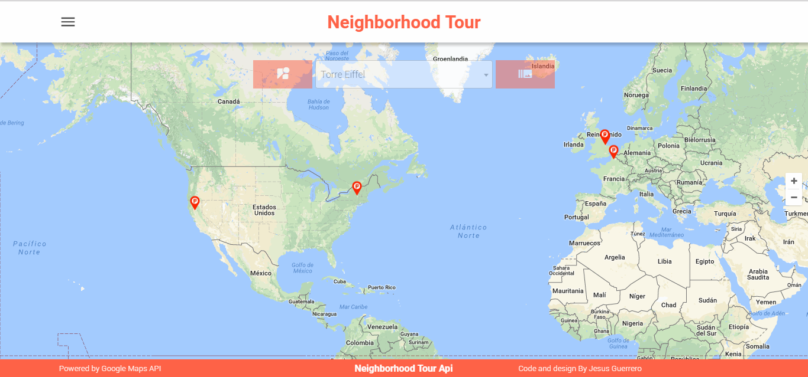

# Neighborhood-Tour

This mini projects is part of the Javascript Design Patterns' Course
it was the final project and was one of my first projects using vuejs, I also explored 
with google maps API.

You can see the result here
[Tour](https://jesusantguerrero.com/neighborhood-tour/)

## Requirements to complete the app

- Review our course JavaScript Design Patterns.

- Download the Knockout framework.(but I used vue instead, since I was learning it)

- Write code required to add a full-screen map to your page using the Google Maps API.

- Write code required to add map markers identifying a number of locations you are interested in within this neighborhood.(my neighborhood is the world :D)

- Implement the search bar functionality to search your map markers.

- Implement a list view of the identified locations.

- Add additional functionality using third-party APIs when a map marker, search result, or list view entry is clicked (ex. Yelp reviews, Wikipedia, StreetView/Flickr images, etc). If you need a refresher on making AJAX requests to third-party servers, check out our Intro to AJAX course (I opted for street view and the images from map)

